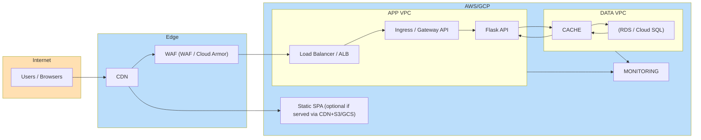

# Innovate Inc. — Cloud Architecture (AWS-first, GCP-ready)

> API based app: React + Flask REST API + PostgreSQL
> Goals: secure by default, low ops overhead now, easy scale to millions, CI/CD from day one

-----

### 1) Executive Summary

We recomend **AWS** as the primary platform using **EKS** for managed Kubernetes and **Amazon RDS for PostgreSQL**. This yields strong security primitives (VPC isolation, WAF, KMS, IAM), heavely managed Postgres, and flexible autoscaling (Karpenter + Spot + Graviton). For teams preferring Google Cloud, an equivalent **GCP/GKE** design is provided (Autopilot or Standard) with **Cloud SQL for PostgreSQL**.

**Why AWS first?**

  - Best fit for our current tooling and expertise (EKS/Karpenter, GitOps, IRSA).
  - Rich Spot/Graviton economics for later growth.
  - Mature managed Postgres (RDS/Aurora) with robust HA/replica options.

-----

### 2) Environment / Account Structure

**AWS Organizations (start smally)**

  - **Mgmt** (payer / org root, no workloads)
  - **Security & Logging** (central CloudTrail, Config, GuardDuty, log archive)
  - **Non-Prod** (Dev + Staging workloads; separate EKS clusters per env)
  - **Prod** (Production workloads; strict controls, separate EKS cluster)

> Start with **3–4 subaccounts** (Mgmt, Sec, Non-Prod, Prod). This isolates blast radius, keeps billing/limits separate, and matches AWS best practices.

**GCP Parity**

  - One **Organization**, two top-level **Folders**: `non-prod/` and `prod/`.
  - **Projects** per env (e.g., `innovate-dev`, `innovate-stg`, `innovate-prod`) and a **shared-security** project for org-wide logging/monitoring.

-----

### 3) Network Design

**AWS VPC (per account/env)**

  - **/16 VPC**, split across **3 AZs**.
  - **Subnets per AZ**:
      - **Public** (ALB/NLB, NAT GW)
      - **Private-Application** (EKS nodes)
      - **Private-Data** (RDS/Redis)
  - **Egress**: 1 NAT GW/AZ (optimize later with VPC endpoints to cut NAT cost).
  - **VPC Endpoints**: S3, ECR (api+dkr), CloudWatch Logs, STS, Secrets Manager, SSM (reduces NAT traffic).
  - **Security**:
      - SGs least-privilege (ALB → app pods via NodePort/TargetGroup binding; app → DB on 5432).
      - NACLs stateless deny patterns (optional; SGs usually sufficient).
      - **AWS WAF** on the internet edge (rate-limit, OWASP rules).
      - **TLS (ACM)** everywhere; SPA + API over HTTPS.

**GCP Parity**

  - **VPC** with subnets per region and **3+ zones**.
  - **Cloud NAT** for egress; **Private Service Connect** to Google APIs.
  - **Cloud Armor** for WAF; **Managed TLS**.

-----

### 4) Compute Platform (Kubernetes)

#### 4.1 Cluster Topology

  - **One EKS cluster per environment** (dev, stg, prod).
  - Private endpoint for prod (or restricted public with IP allowlist + auth).
  - Core add-ons (managed when possible):
      - **CNI** (VPC CNI), **CoreDNS**, **kube-proxy**
      - **Cluster Autoscaler** (optional if using managed node groups only)
      - **Karpenter** (recommended; flexible scale & Spot optimization)
      - **Ingress** via **AWS Load Balancer Controller** (ALB + WAF) or **Gateway API**
      - **ExternalDNS** (Route53)
      - **Cert-Manager** (ACM Private CA optional)
      - **External Secrets Operator** (AWS Secrets Manager/SSM)
      - **Metrics Server**, **Prometheus** (Amazon Managed Prometheus or self-hosted), **Grafana**

#### 4.2 Nodes, Scaling & Scheduling

  - **Node strategy (prod)**:
      - **On-demand baseline** (2–3 small Graviton nodes per AZ) for steady system & critical pods.
      - **Spot burst** via **Karpenter NodePools** (mix of families, multiple AZs, consolidation enabled).
      - **Architectures**: prefer **arm64 (Graviton)** for cost/perf; keep an **x86** NodePool for any incompatible workloads.
  - **Pod autoscaling**:
      - **HPA** for API and SPA backend.
      - Consider **KEDA** for event-driven scaling if queueing is added later.
  - **Policies**:
      - **PodDisruptionBudgets** for API and DB-adjacent services.
      - **Resource requests/limits**, **LimitRanges**, **ResourceQuotas** per namespace.
      - **NetworkPolicies** (deny-by-default; permit only needed flows).

**GCP Parity**

  - **GKE Autopilot** (min-ops) or **GKE Standard** (nodepool control).
  - **NEG + HTTP(S) LB** or **Gateway API**; **Cloud Armor** for WAF.
  - Workload identity for pod→GCP IAM, **Artifact Registry**, **Secret Manager**.

-----

### 5) Containerization & CI/CD

**Images**

  - Multi-stage Dockerfiles:
      - **Backend (Flask)**: build wheel → run on **distroless** or **python:slim**.
      - **Frontend (React)**: build → static bundle to **S3 (+CloudFront)** or serve via NGINX container behind ALB (S3+CDN preferred).
  - **Registry**: **ECR** (image scanning on push).
  - **Supply chain**: SBOM (Syft), sign with **cosign**, provenance (SLSA-aligned).

**CI (GitHub Actions)**

  - OIDC **federation to AWS** (no long-lived secrets/tokens).
  - Jobs: lint/test → build images → SBOM/sign → push to ECR → create versioned Helm/Kustomize artifacts.

**CD (GitOps)**

  - **Argo CD** or **Flux** in each cluster.
  - Promote via branches/tags (dev→stg→prod).
  - Progressive delivery (Argo Rollouts/blue-green/canary) later.

**GCP Parity**

  - **Artifact Registry**, **Cloud Build**, **Cloud Deploy**, OIDC to GCP IAM.

-----

### 6) Database (PostgreSQL)

**Primary Choice: Amazon RDS for PostgreSQL (Multi-AZ)**

  - **HA**: Multi-AZ deployment (automatic failover).
  - **Backups**: Automated daily, **PITR** enabled with sufficient retention (e.g., 7–14 days non-prod, 30+ days prod).
  - **DR**:
      - Cross-Region **read replica** (upgradeable to primary during region outage), or
      - Regular **snapshot copy** to DR region + restore runbook.
  - **Connectivity**: Private subnets only; SG restricted to app nodes.
  - **Performance**: Enable **RDS Proxy** to pool connections from many pods.
  - **Security**: KMS at rest, TLS in transit, rotate creds in **Secrets Manager**; optional IAM auth for DB.

> **Growth path**: If scale surpasses single-instance Postgres, consider **Amazon Aurora PostgreSQL** for faster failover, read scaling, and Global Database.

**GCP Parity: Cloud SQL for PostgreSQL**

  - HA (regional), PITR, cross-region replicas, **Cloud SQL Auth Proxy/Connector**, CMEK with Cloud KMS.

-----

### 7) Security & Compliance

  - **Identity**:
      - Central SSO (IdP) → AWS IAM Identity Center / GCP IAM.
      - GitHub OIDC → short-lived deploy roles.
      - **Least privilege IAM**; break-glass roles and MFA.
  - **Perimeter**:
      - **WAF** (AWS WAF / Cloud Armor): OWASP, geo/rate rules.
      - DDoS protection (AWS Shield / Google Edge defenses).
  - **Secrets**: External Secrets Operator → AWS Secrets Manager / GCP Secret Manager.
  - **Encryption**: Everything KMS-backed (EKS secrets encryption, RDS/Cloud SQL, S3/GCS, ECR/Artifact Registry).
  - **Kubernetes**:
      - PSP replacement via **Pod Security Admission** (baseline/restricted).
      - ImagePolicy/Admission controls to require signed images.
      - Private cluster endpoints for prod or tight IP allowlists.
  - **Audit / Logging**:
      - CloudTrail/Config/GuardDuty (AWS) or Audit Logs/SCC (GCP).
      - Central log archive + immutable retention.
  - **Data protection**: Data classification, access reviews, minimal data retention.

-----

### 8) Observability

  - **Metrics**: Amazon Managed Prometheus (or self-hosted), Grafana (Amazon Managed Grafana).
  - **Logs**: Fluent Bit/CloudWatch Logs; structure app logs (JSON).
  - **Tracing**: OpenTelemetry SDK → AWS X-Ray (or Cloud Trace).
  - **Alerts**: SLO-based alerts (latency, error rate, saturation), on-call rotation, runbooks.

**GCP Parity**: Managed Service for Prometheus, Cloud Logging, Cloud Monitoring, Cloud Trace, Cloud Profiler. 

-----

### 9) Cost & Scaling Plan

**Phase 0 (MVP, low load)**

  - Small EKS/GKE cluster, minimal on-demand nodes, no Spot yet.
  - SPA hosted on **S3 + CloudFront** (or **GCS + Cloud CDN**) to reduce cluster load.
  - RDS db.t4g.small (or GCP equivalent) with Multi-AZ.

**Phase 1 (Growth)**

  - Add **Karpenter** Spot NodePools (or GKE autoscaling) for burst.
  - Turn on WAF managed rules, ExternalDNS, AMP/AMG dashboards.
  - Add **RDS Proxy** and read replicas if read-heavy.

**Phase 2 (Growth)**

  - Scale out with HPA/KEDA, shard caches (ElastiCache/MemoryStore).
  - Consider **Aurora PostgreSQL** / **Cloud SQL high-scale** patterns.
  - Global footprint (multi-region active/passive), cross-region failover plans tested.

**Cost traps & tips**

  - Reduce NAT GW egress via **VPC endpoints** for AWS APIs/ECR/S3.
  - Use Graviton/ARM where possible.
  - Turn on image/layer caching in CI.
  - Right-size RDS; monitor storage IOPS.

-----

### 10) Repository Layout (Terraform & App)

This architecture pairs well with the following repo structure (already used in our infra work):

```
infra/
├── 00-backend/ # Terraform remote state backend (S3)
├── 01-base-infra/ # VPC, subnets, NAT, Endpoints, Route53, KMS, IAM
├── 02-eks-cluster/ # EKS, nodegroups, IAM roles (IRSA), ALB controller, ExternalDNS
├── 03-karpenter/ # Karpenter Helm release + NodePools (on-demand, spot, ARM/x86, graviton)
├── 04-k8s/ # Deployments, Ingress/Gateway
├── 05-data/ # Database (Aurora, Redis)
└── 06-observability/ # Logs, Metrics, Alarms, Tracing
app/
├── backend/ # Flask service (Dockerfile, tests)
└── frontend/ # React (Dockerfile for NGINX OR S3+CloudFront deploy)
```

**Pipelines**

  - **CI** (GitHub Actions): lint/test → build → sbom/sign → push → publish Helm/Kustomize.
  - **CD** (Argo CD / Flux): watches env branches; sync waves (infra add-ons → shared services → app).

-----

### 11) High-Level Diagram



-----

### 12) GCP Mapping (Feature Parity)

| Capability | AWS (this design) | GCP Equivalent |
|---|---|---|
| Managed K8s | EKS | GKE (Autopilot or Standard) |
| Autoscale burst | Karpenter + Spot + Graviton | GKE autoscaling + Spot VMs; Autopilot abstracts nodes |
| Ingress & WAF | ALB Controller + AWS WAF | HTTP(S) LB / Gateway API + Cloud Armor |
| Registry | ECR (scan on push) | Artifact Registry (vuln scanning) |
| Secrets | Secrets Manager + External Secrets | Secret Manager + ESO |
| DB | RDS for PostgreSQL (Multi-AZ) | Cloud SQL for PostgreSQL (regional) |
| Observability | AMP/AMG, CloudWatch, X-Ray | Managed Prometheus, Cloud Logging/Monitoring, Cloud Trace |
| CI/CD | GitHub Actions + Argo CD | Cloud Build / Deploy + Argo CD (optional) |
| IAM to CI | GitHub OIDC → IAM roles | GitHub OIDC → GCP Workload Identity |

-----

With Love Alejandro
